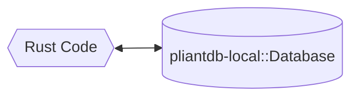
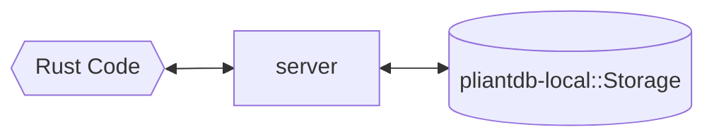
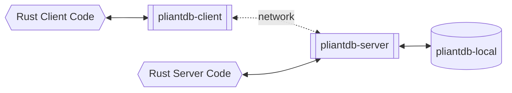
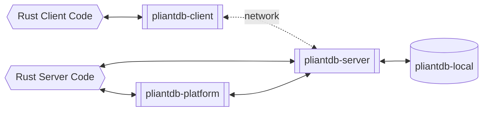
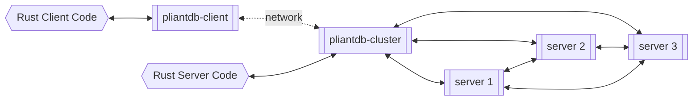

# Use cases of PliantDB

## Single database model (No networking)

This use case is most similar to utilizing SQLite for your database. In this mode, PliantDB directly interacts with files on your disk to provide your database. Unlike other file-based databases, however, it's easy to migrate to any of these scenarios from this starting position:

A working example of how to use a local database can be found at [`pliantdb/examples/basic-local.rs`](https://github.com/khonsulabs/pliantdb/blob/main/pliantdb/examples/basic-local.rs).

## Multi-database model (No networking)

This model is most similar to using multiple SQLite databases. In this mode, you interact with a [`Storage`](https://pliantdb.dev/main/pliantdb/local/struct.Storage.html) that you spawn within your code.

If you look at the source behind [`Database::open_local`](https://pliantdb.dev/main/pliantdb/local/struct.Storage.html#method.open_local), you'll see that the single-database model is using `Storage` under the hood.

## Server model (QUIC or WebSockets)

This model is most similar to using other document databases, like CouchDB or MongoDB. In this mode, you interact with a [`Client`](https://pliantdb.dev/main/pliantdb/client/struct.Client.html) that connects via either QUIC or WebSockets with a server. From the server code's perspective, this model is the same as the multi-database model, except that the server is listening for and responding to network traffic.

A working example of this model can be found at [`pliantdb/examples/server.rs`](https://github.com/khonsulabs/pliantdb/blob/main/pliantdb/examples/server.rs). When writing client/server applications that utilize `PliantDB`, you can have the `PliantDB` server running withing your server application. This means that your server still has the ability not use networking to interact with `PliantDB`. Regardless of if you run any other server code, your `PliantDB` server will be accessible through a `Client` over the network.

## Coming Later: API Platform model (QUIC or WebSockets)

If you're finding yourself developing an API for your application, and all of the consumers of this API are already connected to `PliantDB`, you may want to take advantage of the `platform` feature. This is not implemented yet, but the vision is that by implementing a few callbacks to handle and respond to your own serde-compatible request type, you can implement a custom API that can be used directly from clients. And, by taking advantage of the permissions model that will be developed, you can even expose this API over the internet safely.

## Coming Later: Cluster model

When you're at the stage of scaling beyond a single server, you will be able to upgrade your server to a cluster using the hypothetical `pliantdb-cluster` crate. The clustering model is still being designed, but the goal is something similar to:

In this model, the local storage element is hidden; Each server has its own storage. This model is very similar from the viewpoint of your server and client code -- the primary difference is that the server-side connection is being established using the cluster crate. From the client's perspective, the cluster behaves as a single entity -- sending a request to any server node will result in the same result within the cluster.

All features of PliantDB will be designed to work in cluster mode seamlessly. `PubSub` will ensure that subscribers will receive messages regardless of which server they're connected to.