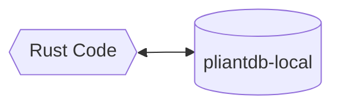
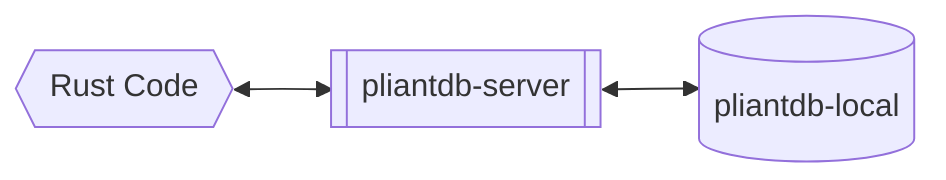
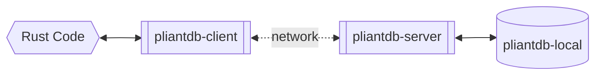

# Use cases of PliantDB

## Single database model (No networking)

This use case is most similar to utilizing SQLite for your database. In this mode, PliantDB directly interacts with files on your disk to provide your database. Unlike other file-based databases, however, it's very easy to upgrade from a single-database, local-data only storage model to a remote server-based deployment.

A working example of how to use a local database can be found at [`pliantdb/examples/basic-local.rs`](https://github.com/khonsulabs/pliantdb/blob/main/pliantdb/examples/basic-local.rs).

## Multi-database model (No networking)

This model is most similar to using multiple SQLite databases. In this mode, you interact with a [`Server`](https://pliantdb.dev/main/pliantdb/server/struct.Server.html) that you spawn within your code. The server uses pliantdb-local as its underlying storage mechanism.

## Server model (QUIC or WebSockets)

This model is most similar to using other document databases, like CouchDB or MongoDB. In this mode, you interact with a [`Client`](https://pliantdb.dev/main/pliantdb/client/struct.Client.html) that connects via either QUIC or WebSockets with a server. From the server code's perspective, this model is the same as the multi-database model, except that the server is listening for and responding to network traffic.

A working example of this model can be found at [`pliantdb/examples/server.rs`](https://github.com/khonsulabs/pliantdb/blob/main/pliantdb/examples/server.rs).
